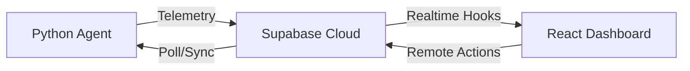

# 💻 Laptop Life-Saver System
> *Predictive Maintenance & Fleet Management for Nyanza District*

Laptop Life-Saver is a comprehensive platform designed to monitor the health and reliability of educational laptop fleets. It combines a lightweight Python-based monitoring agent with a powerful real-time React dashboard.

## 🚀 Key Features

### 🛠️ Real-time Monitoring (Agent)
- **Performance:** CPU Temperature, Load, RAM Usage, Disk Space, Battery Health.
- **Health Classification:** Real-time green/yellow/red status indicators based on configurable thresholds.
- **Offline Resilience:** Local JSON buffering ensure data survives network outages.

### 🏢 Advanced Fleet Management (Phase 1)
- **Inventory Tracking:** Automatic detection of CPU Model, RAM capacity, and Disk types (SSD vs HDD).
- **Metadata Management:** Assign laptops to specific **Schools/Departments**, track **Asset Tags**, and **Assigned Users**.
- **S.M.A.R.T. Health:** Deep disk failure prediction monitoring.
- **Remote Maintenance:** Trigger maintenance actions like `FORCE_SYNC` directly from the dashboard.

### 📊 Real-time Dashboard
- **Fleet Overview:** Global health distribution and alert summary.
- **Predictive Scoring:** Health scores (0-100) based on historical telemetry.
- **Live Notifications:** Browser push alerts for critical hardware failures.

## 🏗️ Architecture

## 🛠️ Tech Stack
- **Agent:** Python 3.10+, `psutil`, `wmi`, `requests`.
- **Dashboard:** React 19, Vite, TailwindCSS, Lucide-React.
- **Backend:** Supabase (PostgreSQL, Realtime, Auth, RLS).

## 🚦 Quick Start

### 🛡️ Windows Agent (Automatic Installation)
The agent now handles its own installation to `C:\Program Files\`.
1. Run **LaptopLifeSaver_Agent.exe** from any location.
2. The agent will ask for Admin permission to install itself permanently.
3. Follow the setup wizard to register your device.

### 📊 Dashboard
1. Open a terminal in the `dashboard` folder.
2. Run `npm run dev`.
3. Open `http://localhost:5173`.

## 🧪 Automated Testing
Run the full test suite to ensure system reliability:
- **Agent:** `python -m pytest agent/tests/` (requires Python environment)
- **Dashboard:** `cd dashboard && npm test`

## 📖 Documentation
- [Detailed Deployment Guide](./DEPLOYMENT_GUIDE.md)
- [Supabase Schema Documentation](./supabase/schema.sql)
